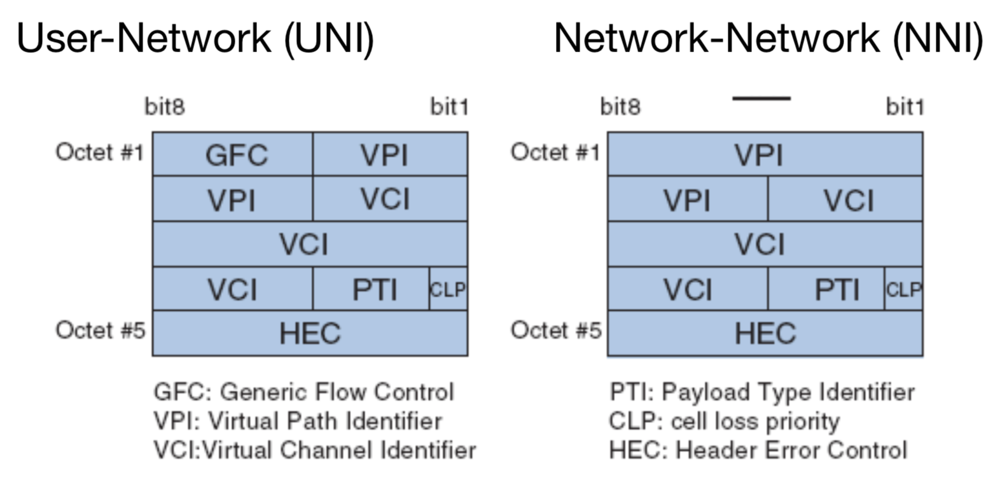

# ATM - 异步传输: 固话公司的回马枪(笑
***（LowerLayers.pdf 46页）***

## 前提
* ATM = Asynchronous Transfer Mode
* 把数据，电话，视频混合在一起
* 在那个年代视频和数据是两个分开的东西，当时是想要把各种各样的服务混合在一起

## 小故事
* 由于一些政治博弈，数据最终被分为了48-byte packets
	* 美国人想要64-byte，而法国人想要32-byte 因为传输声音时他们不想做回音消除
	* 最终被妥协为48-byte
	* 人的大脑是很善于处理回音的，比如在房间中交流会产生回音, 但是在50ms内的回音都会被大脑“自动消除”。
	* 通话其实是会产生回音的，你自己会听到自己说的话，所以通信公司一般把目标定为回音返回控制在35ms以内，这样你就听不到。
	* 在越长的通话距离内，回音现象会越严重，比如在纽约打电话到加州，你不论做啥都不可能把延迟降低到35ms以内，而法国就不存在这个问题。这就是为啥法国不想要回音消除。
* 这些本质上是在点对点中提供虚拟线路(virtual circuits), 因此只需要5-byte作为header (约为48byte中的10%)

## 问题
* 交换一个大数据包？没问题，但交换一个小数据就是非常低效的了(header很大，而且要经过多次路由)  
Switching a stream of small datagrams is allegedly very inefficient (large headers, lots of routing decisions)
* 他们知道这个问题的存在，因此ATM是以虚拟电路为导向的(virtual circuit orientated)

### 那到底 ATM Headers 长啥样？
前面提到一个header只有5byte的长度，但内容却全揉杂在一起，等之后几章讲IP的header的时候你再看看，高下立判。

##把线路给钉起来(°∀°)ﾉ Nailed up ciruits
