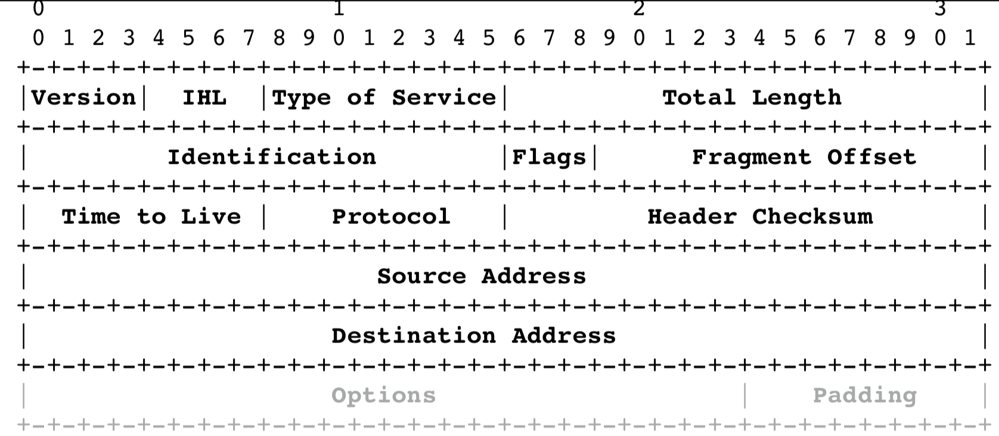

# IP, “妙不可言”
***（Lecture5-IP.pdf 第3页，Panopto: 19 Oct)***

## 小故事
### 为啥要用IP?
* 毫无疑问，这是过去三十年来占主导地位的网络协议(networking protocol)
* 一个单一的网络层, 即可让所有传输在上面运行，以及...  
a single network layer, over which all transports can run, and...
* 还记得上一章提到的那些底层吗？这个单一的网络层，它可以运行在任何底层上  
a single network layer which can run over all available lower layers

### 什么是IP？
* 一个不可靠的，乱序的数据传输服务(datagram service) ヽ(`Д´)ﾉ
* 你把地址放入一个包中，我们的network会尝试“尽最大努力”把它送到某个地方(但愿是正确的地方233
* 没有“校验和”(checksum)覆盖在数据上, 所以即便你是想防止损坏，那也得依赖更上一层的服务了
* 恐怕没有比这个更烂的网络层了吧(苦笑)

### 那IP又是怎么赢下这场战斗的呢？
* 一个可能的原因是，它是被正式发布了的，每个人都能知道怎么回事怎么去应用它
* 实现起来简单，而且是80年代计算机研究院们“最喜欢的” (Lisp Machines, Berkeley Unix, TOPS-10...)
* 不论在什么上面都能跑，不论是long-haul radio 还是高速光纤

## 包格式 Packet Format
* 每一行32bits, 4bytes, 1**word**
* Options是可选项，所以一个典型的header是20bytes (5words)

###IHL (Internet Header Length)
* IHL是header的长度(32bit)
* 通常情况下是5bit (20bytes)
* 如果大于5，那么说明有options在里面
	* IP options大多数情况下都是过时, 无用，不安全的
	* 防火墙程序通常会把这些options去掉，因为本来就没什么用

