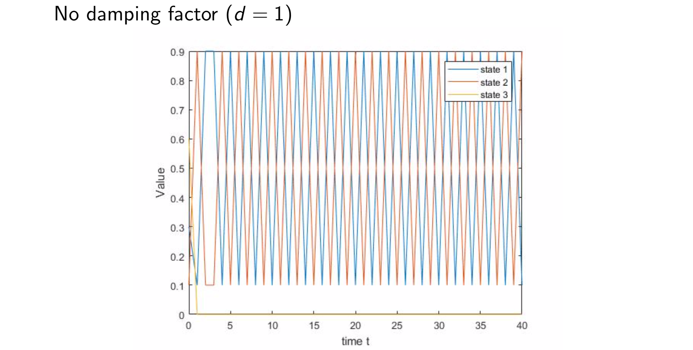
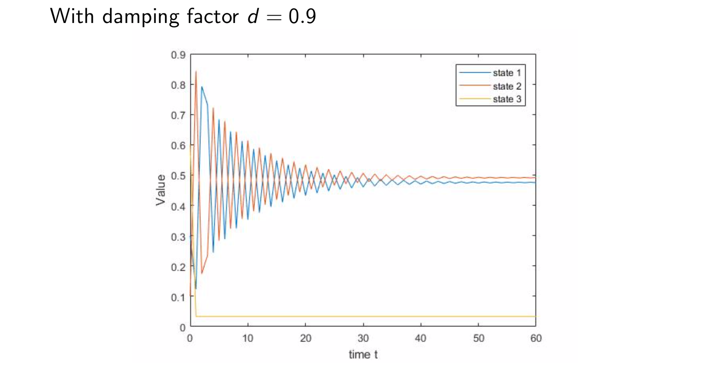

# Damping Factor 阻尼因子
***(PageRank.pdf 30页)***  

## 问题所在
* 到目前为止所有页面(dn) 的权重(authority) Xn 已经通过计算所有指向它的超链接而得出了。  
* 因此当一个页面没有任何超链指向其时 它的authority为0 
* 那如果此时有一个新的页面出现，肯定是没有任何链接指向它的，那岂不是也成0了？&nbsp;&nbsp; (╯°口°)╯(┴—┴

## 解决方案
 
 
 * D 是默认获得的authority比例(proportion of authority that a page gets by defualt)
 * D 是一个于0到1之间的实数
 * 我们说一个页面的Authority 它是由两部分组成的:  
 一. 所有超链接指向该页面所赋予的权重  
 二. 默认获得的authority
 
 * 还记得之前算simple page rank的公式吗？现在变成了这样
   
 
 W是动态转移矩阵  
 在第i+1次为页面赋值权重时，该页面的权重x为原公式Wx(i)乘了一个d (用于降低一点点权重)  
 然后再加上后面的一坨常量 (默认赋值)
 
 * 把以上这个看作一个动态的系统，它可以使任何初始值X(0)收敛到一个固定点X*  
 * 例：当没有阻尼因子时，无法收敛  
   
 有阻尼因子后，正确收敛  
 
 
 * 因此当你有了Damping Factor之后，你总是可以获得收敛的效果，但注意你用Damping Factor的动机(motivation)是在于避免0权重的页面出现