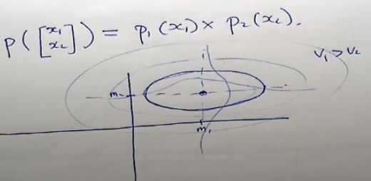

# Gaussian PDF

***(GMMs.pdf 第12页，Panopto: 14 March 2019 at 10:07 (25:03))***

## 带你进入高维世界

* 假设你现在有一个二维的PDF，她长什么样呢？
* 首先和之前的一维P(x)一样，你要有一个点，但是这个点是在2维空间中的, 所以是个向量  
  
* 你可以把它看作两个一维的PDF乘在一起 P(x1) x P(x2)  
  
* 在这个二维点中，每个维度也有自己的mean和variance (m1 m2 v1 v2)
* 我们假设v1 > v2 图像将会是下面这个样子 (注意有两个m)  

* 和一维的一样 越到外面分布越少  

* 当然图像也有可能长下面这样，但这样你就可以应用PCA了啊！  
