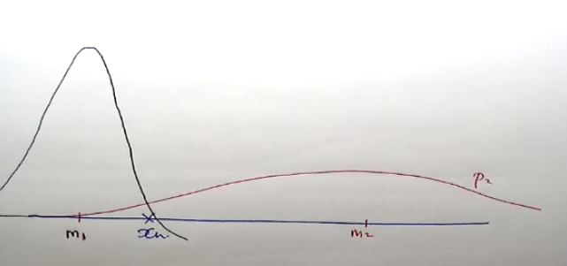
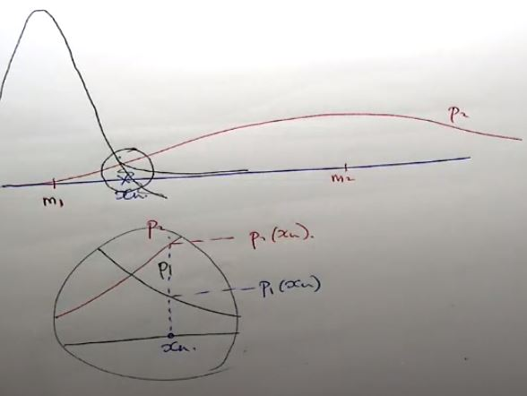
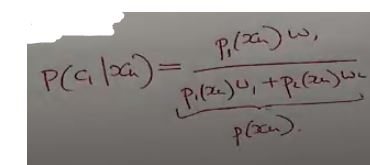

# E-M Algorithm
***(GMMs.pdf 第31页，Panopto: 14 March 2019 at 10:52 (23:45))***

* 我现在有一个数据xn, 但我并不知道这个数据是属于哪一个component的  
  
* 先猜测M的个数为2，那么我们不单猜测M为2，我们把别的也都给猜了
* 这和K-means很像，我们也是先猜centroids在哪个位置 然后再让算法去跑
 

* 我们再把P1和P2的m和v给猜测了  
 
* 根据我们猜测的m1 m2位置，把图像画出  
 

* 现在我们能看出xn在p1和p2上的值分别是多少

* 然后用贝叶斯定理算 P(c1|xn) //c1指component1 算的是the probability of component 1 given by data point Xn 

* 刚好下面一坨就是p(xn)
* 然后同样的算法算P(c2|xn) 看哪个更大  

* 对于每一个数据点，都这样算，就能分出该数据点属于哪一边

## 总结E-M算法
1. 猜测(Guess) P1(m1,v1), P2(m2,v2)，然后再猜权重w1,w2
2. 