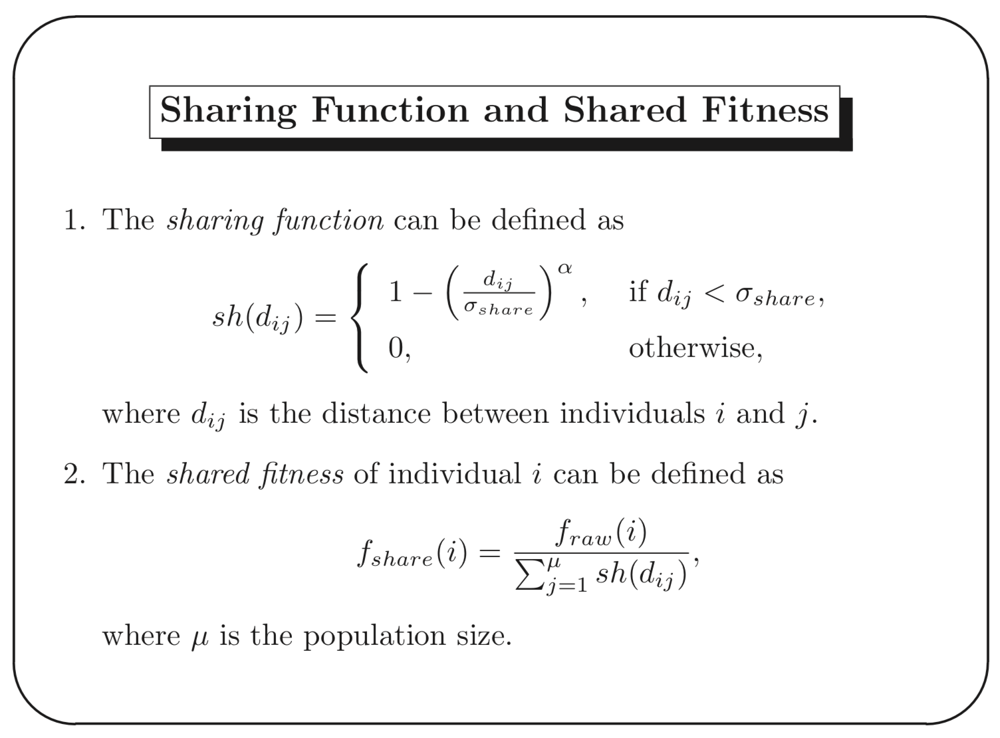
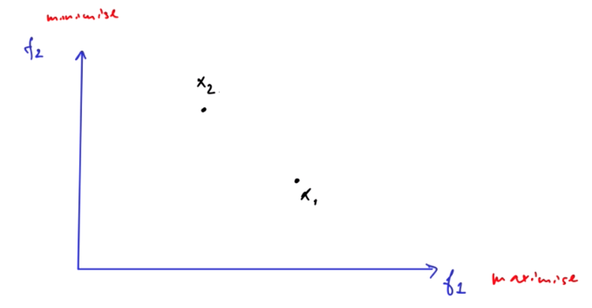
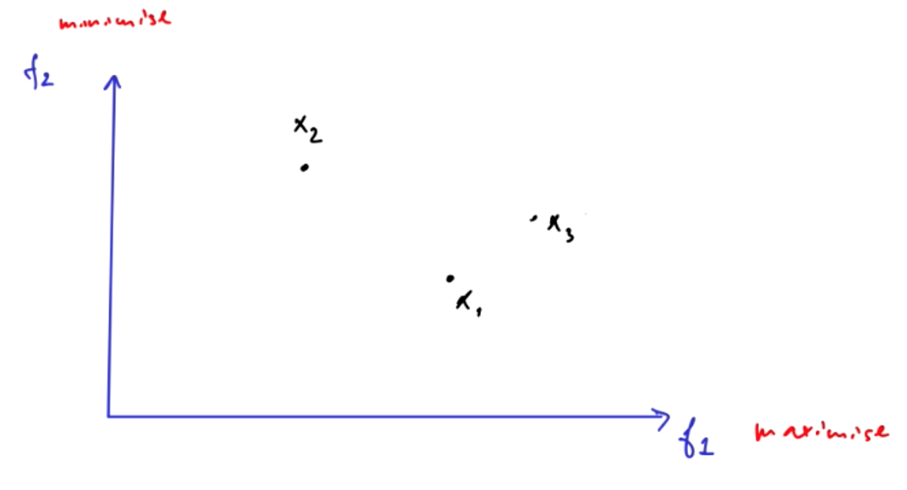
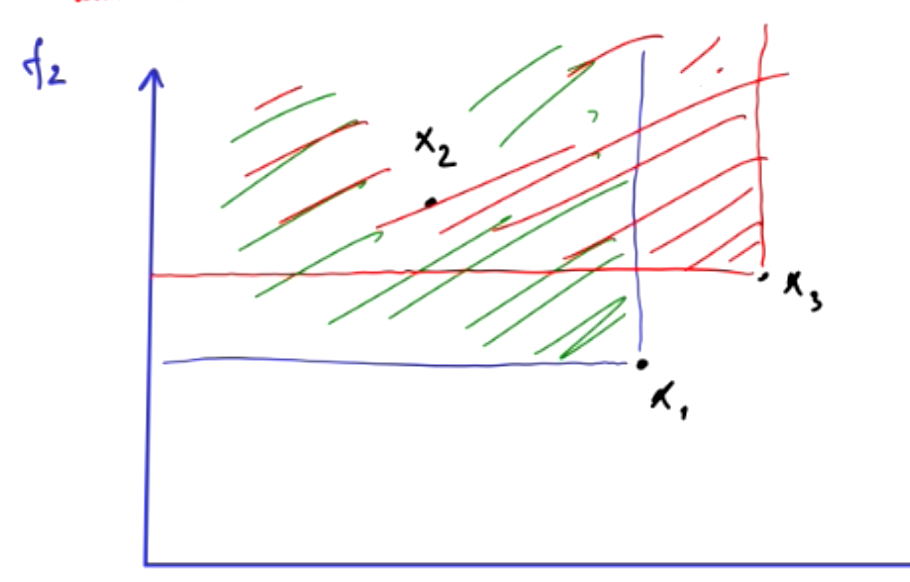
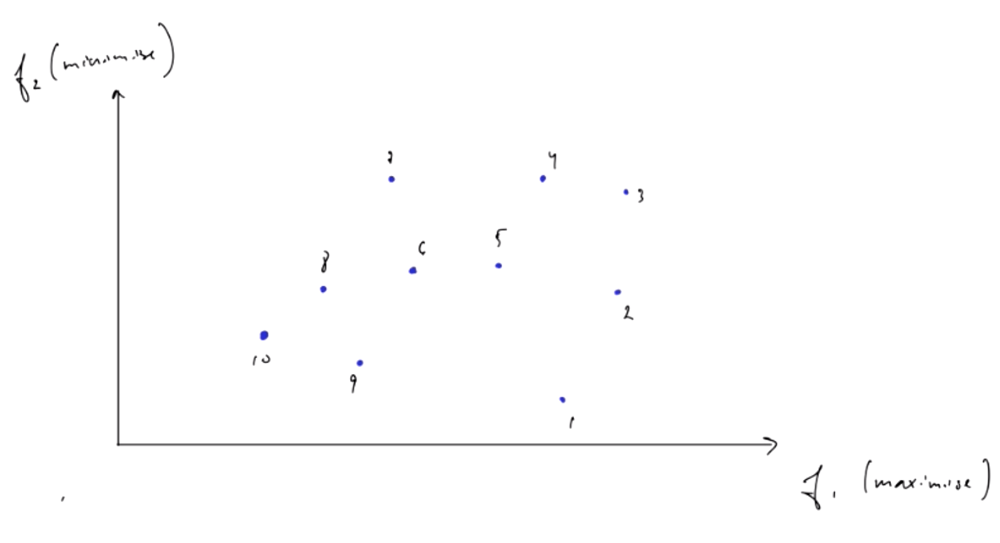
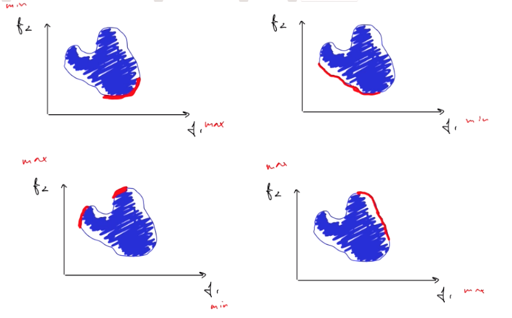

# NISO

## Lecture2
* Brute-force 蛮力解决方案时间复杂度位 O(n<sup>2</sup>)  

#### 因此有了启发式算法
* 比如Local Search e.g. greedy search
* Randomised algorithms, which include Evolutionary Computation

#### 启发式算法的定义
A (usually simple) algorithm that produces a **good enough** solution for a problem in a reasonable time frame.

## 两个随机算法
给一个包含n个数的数组，找到一个数的值等于x
### Las Vegas
``` 
begin
	repeat
			Randomly select one element a out of n elements
	until a == x
end

``` 
### Monte Carlo
多了一个判定条件，循环次数到一定之后也会停止
``` 
begin
	i = 0
	while (i == k || a == x)
		Randomly select one element a out of n elements
		i += 1
	end
end
``` 

### 这两个的区别
* Monte Carlo的运行步数是固定的
* Las Vegas相当于是在无限循环，直到找到正确结果

## Lecture3
* 用启发式算法解决TSP问题
	* 随机算法 Randomised Algorithms
	* 局部搜索 Local Search Algorithms

### TSP问题对于其它算法是很难的
* 主要是在时间复杂度上
	* Brute force 需要O(n!), 需要花费大量的时间
* 需要注意的是 随机算法仍旧有效，因为它的exploration性质，但由于纯随机算法无法exploitation，不能利用有效的结果，因此纯随机算法是不好的。但结合起来是可以的

### Local Search Algorithm 局部搜索算法
* 用于解决难移优化问题的启发式算法
	* 从对解决方案的初步猜测开始，逐步改进它，直到得到最优解  
	Start with an initial guess at a solution and incrementally improve it until it is one.
	* 增量改进: 局部变化，例如慢慢迭代移动到邻近解  
	Incremental improvement: local changes, e.g. the algorithm iteratively moves to a neighbour solution.

``` 
X0 = 初始解
new_best = X0
while()
	Modify current solution to neighbourhood solution
	如果当前解是更好解 则赋值当前解到new_best
	直至满足终止条件退出

``` 

#### 局部搜索中的爬山算法
* 最简单的局部搜索之一
* 引入的一个重要概念是immediate neighbour solutions: most similar solutions to the current solution.

* 两种实现方法
	* Simple hill climbing: chooses the **first** better solution
	* Steepest ascent hill climbing: compares all neighbour solutions and chooses the best solution.

* 伪代码和就是上面的局部搜索算法，增量改进中把邻近解改为直接邻近解

### 爬山算法在TSP中的应用
* 2-opt （重要）
	* 选两个点，切断路线 交换顺序重新连接即可
* 但2-opt是一个局部搜索方法，因此我们需要接入随机性来提升效果

<br/>

### Simulated Annealing
以一定概率去接受差解，来逃离局部最优

不用默写伪代码，但你需要了解它的机制
伪代码
``` 
``` 
### Representation (子代的形式)
* representation的选择基于不同的问题
	* Binary Representation 二进制表现 (L5-15页)
	* Real number representation 实数表现，解决工程优化问题


### Selection Schemes 选择机制
* 深度了解其中一种选择机制 并在说明你在GA中为什么要用这个选择机制(他们之间的区别其实不大)

### Real-valued coded evolutionary algorithms
* Real valued mutation 有两种形式，你需要了解其中一种并作出解释
* Uniform mutation / Gaussian mutation: replace ci with random
* Non-uniform mutation


## Shan He 最后一个重要的部分：Constraint Handling
* 限制优化问题是什么
* 如何处理这些限制的？

### 惩罚机制
* 在原有的fitness函数中增加惩罚机制

* 几种不同的惩罚方法
	* static penalties
	* dynamic penalties
	* adaptive and self-adaptive penalties

* 一句话解释Constraint handling  
* 改变ranking的排序，不仅仅基于fitness，还有violation of constraint

<br/>

## Per的部分：Niching
* 指的是群体中一组组个体的形成，每一组的个体是相似的，而来自不同组的个体是非常不同的。  
It refers to the formation of groups of individuals in a population. Individuals within a group are similar to each other, while individuals from different groups are very different from each other.

* 为什么要Niching？
	* 保持种群多样性，从而更好的explore search space
	* 可以同时优化多个目标 helps to optimise multiple objectives simultaneously.
	* 有助于学习一组相互协作的机器学习系统  
	It helps to learn an ensemble of machine learning system that cooperate.  
	* 有助于模拟复杂系统/自适应系统 (如人工生态系统)

* Niching技巧可以让我们在进化过程中同时发现多个峰值
* 每种niching技巧都有自己的"niche", 对于不同问题应该用不同的niching方法
* 当使用fitness sharing技巧时，种群大小成为一个重要的参数

## 两种Niching技巧
### Fitness Sharing
* 将个体原本的fitness转为共享fitness
* 只有有限和固定数量的资源(fitness值)，拥有相同利基(niche)的个体必须共享资源  
The idea is that there is only limited and fixed amount of “resources” (i.e., fitness value) available at each niche. Individuals occupying the same niche will have to share the resources.
* 共享Fitness的公式  
	

<br/>

### Crowding
* 通过替换相似的个体来将新个体插入种群中  
Crowding techniques insert new individuals into the population by replacing **similar** individuals.

* 保持种群原有的多样性  
Maintain the **pre-existing** diversity of a population.

* Crowding不会修改fitness

<br/>

## 多对象进化算法 Multi-objective EA
* 之前讲的所有都是单一对象的进化，做一个线性拟合把所有对象的和算出来
* 2018年1(c)这种题型
* 你想f2轴最小化，f1轴最大化。哪个solution是最优的？  

* 答案肯定是x1，因为它在两个维度上都是最优的
* 那么如果是这样的话呢？  
  
你无法直接说出x3就比x1好

### 引出概念Domination（重要）
定义：
X dominates Y if  
(1) X is no worse than Y in all objectives.  
(2) X is strictly better than Y in at least one objective.

* Based on Domination，X1 dominate all ponts in green area  

* X2 same  


### 更复杂一点的例子

#### PARETO-Optimal Solution（重要）
Among a set of solutions P, the non-dominated set of solution P' are those that are not dominated by any member of the set P.  

* 总的来说一组两个objective的图，在四种情况下应当是如下四个方向的数据是dominated  

* 找Pareto-optimal solution的时间复杂度是O(MN<sup>2</sup>)

### NSGA-II

输入值：一个父代种群P<sub>t</sub>，一个子代种群Q<sub>t</sub>. (每一个大小是N)  
Input: A parent population P<sub>t</sub> and offspring population Q<sub>t</sub>. (each of size N)

(1) 首先，将这两个集合合并R<sub>t</sub> = P<sub>t</sub> U Q<sub>t</sub>，然后排序为non-dominated fronts, F<sub>1</sub>, F<sub>2</sub>... 一组组的front  

(2) 设index i = 1，设下一代种群为空 P<sub>t+1</sub> = 0

(3) 循环 while 下一代种群数 |P<sub>t+1</sub>| + 下一层front数 |F<sub>i</sub>| < 原种群大小N 时 (也就是还没填满时):  
&nbsp;&nbsp;&nbsp;&nbsp;&nbsp;&nbsp;&nbsp;
P<sub>t+1</sub> += F<sub>i</sub> // 把front加入新种群  
&nbsp;&nbsp;&nbsp;&nbsp;&nbsp;&nbsp;&nbsp;
i++ // 继续一层一层加，直到无法完整的加入一层为止

(4) Perform crowding sort on F<sub>i</sub> （在最后不能加满的那一层front做crowding sort）  
&nbsp;&nbsp;&nbsp;&nbsp;&nbsp;&nbsp;&nbsp;
将最后一层中最widely spread的几个数据加进去，种群中差几个加几个 N-|P<sub>t+1</sub>|个


<br/>

## Co-evaluation (简略讲)
* 一个个体的fitness取决于其它fitness
	* Fitness landscape changes
	* Fitness of an individual may be different in different runs
* 