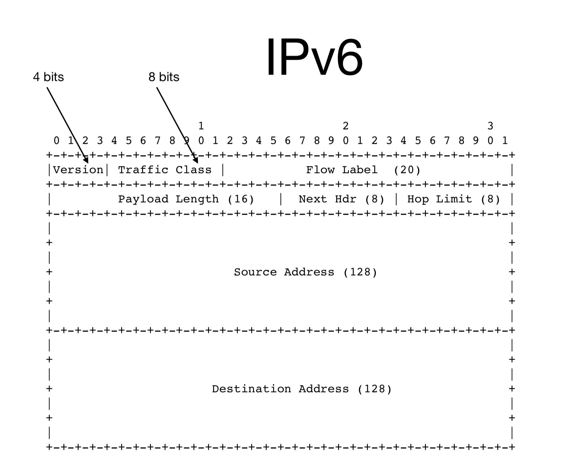

# IPv6

***（Lecture5-IP.pdf 第43页，Panopto: 19 Oct 15:26)*** 

### 前提摘要

* 32位地址(IPv4)早已用完，最后一个 /8 在2011年被用掉了

* 128位的IPv6地址可以提供296倍于IPv4的数量

 

### 现实中IPv6应该说是264

* 就目前而言，最小的分配单位是/64;  
Minimum allocation unit is a /64; 

* 我们每次处理IPv6地址时，只会处理前64个bits    
Every time we hand out the IPv6 address, we only hand out the first 64 bits (called prefix)

* 比方说你的手机会得到一个 /64，如果你手机开热点的话 则把后面的地址又分配出去 (在本地网络上分配更加容易)  
Your mobile phone will probably get a /64, intention is that with 64 bits available after the routed "prefix", **allocation of addresses on local networks is much easier**

 

## IPv6的结构
* 前4个bit是版本号 = 6
* 8个bits的traffic class 和IPv4一样
* Next Hdr，8bits是包的类型，UDP TCP?
* 需要注意的是没有checksum

 

## Flow Classifiers

* 这个想法是用20bit来标记“相关”的flow(也就是packet)，这样路由器看到这个包时就知道是什么，然后可以以一种最小化重新排序，延迟变化等方式处理它  
Idea is that you have 20 bits to mark "related" traffic, so that routers can process it in a way which minimises reordering, delay variation, etc.